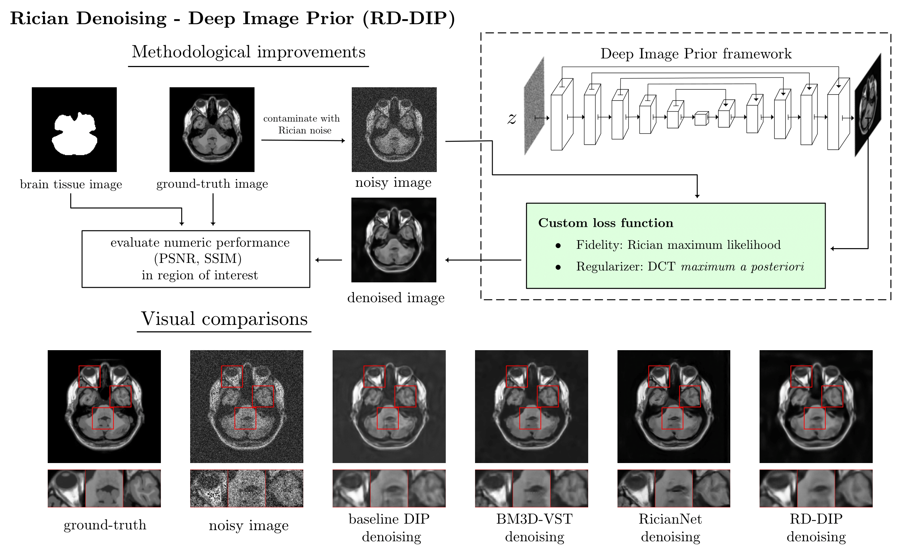
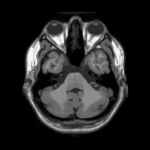
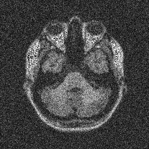
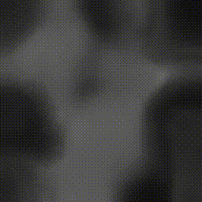
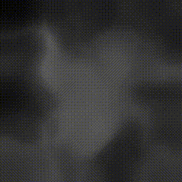

# RD-DIP: Rician Denoising - Deep Image Prior

*by HR Iglesias-Goldaracena, I. Ramírez & E. Schiavi.*

This repository contains the dependencies, code and datasets for harnessing RD-DIP, a major enhancement for the unsupervised learning Deep Image Prior (DIP) that allows it to perform Rician denoising.

Try it without installing *anything*—click [here](https://colab.research.google.com/github/heqro/rd-dip/blob/main/demonstration-of-usage.ipynb) to open the project in Google Colab!

## Graphical abstract




## Visualization of the (iterative) denoising process

|   |   |
|---|---|
| **Ground-truth**  | **Noisy** ($\sigma=0.15$)  |
|   |  
| **Baseline DIP** | **RD-DIP** |
|  |  |


## Getting started

Clone the repository and initialize the modules:
```
git clone git@github.com:heqro/rd-dip.git
cd rd-dip
git submodule init
git submodule update --recursive --remote
```

Now, create a virtual environment, activate it and then and install the dependencies:
```
python -m venv .venv
source .venv/bin/activate 
pip install torch torchvision torchaudio --index-url https://download.pytorch.org/whl/cu118
pip install piqa
pip install scikit-image
```

Note that the previous codeblock installs `torch` with the CUDA 11.8 version, as it is the version this software package was developed with.
